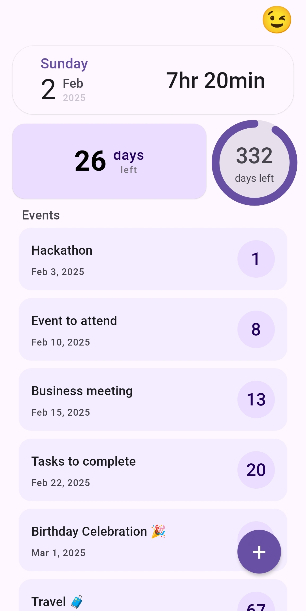
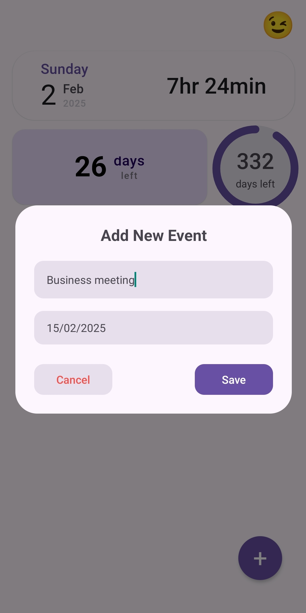
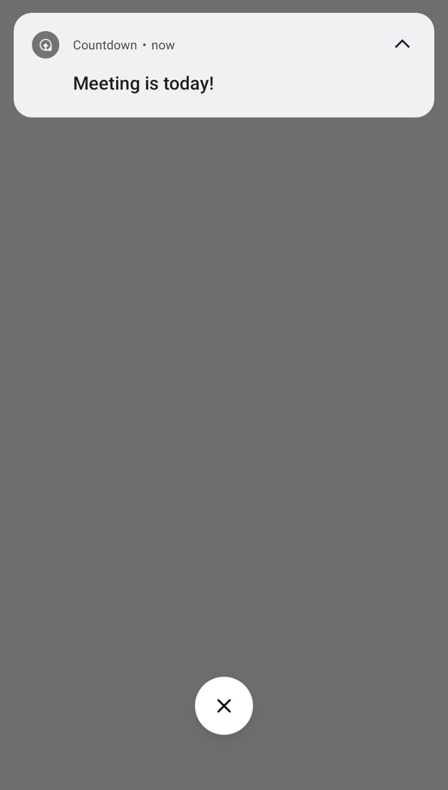

# Countdown app 👋

### Download : [Countdown](https://countdownday.netlify.app/)
## 🚀 Features  
- The app comes with dark and light mode
- Track days left for goals/events  
- Visual progress circles (month/year)  
- Material You design  
- Deadline reminders & priority sorting

## App Interface
### Home Screen
 

### Add Event

### Notification
 

## Download Android App
Get the latest APK: [Download Countdown](https://countdownday.netlify.app/)

Installation Steps:

1. Enable "Unknown Sources" in Android Settings

2. Download APK file

3. Open file & follow prompts

4. Launch app & start tracking!
